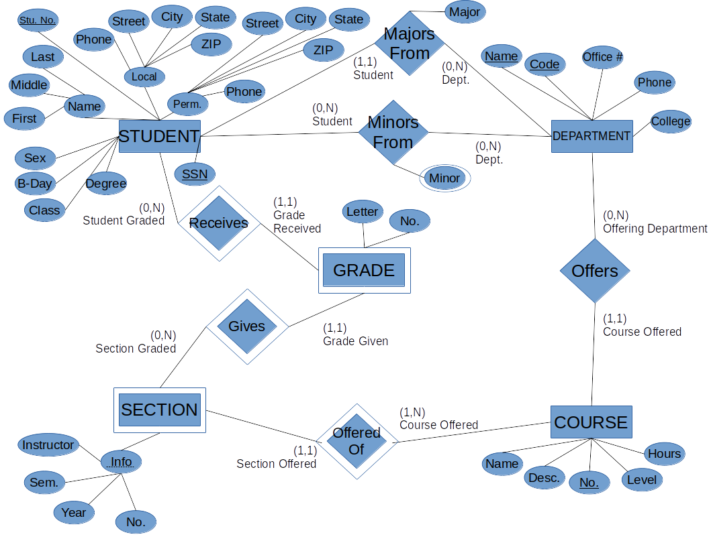
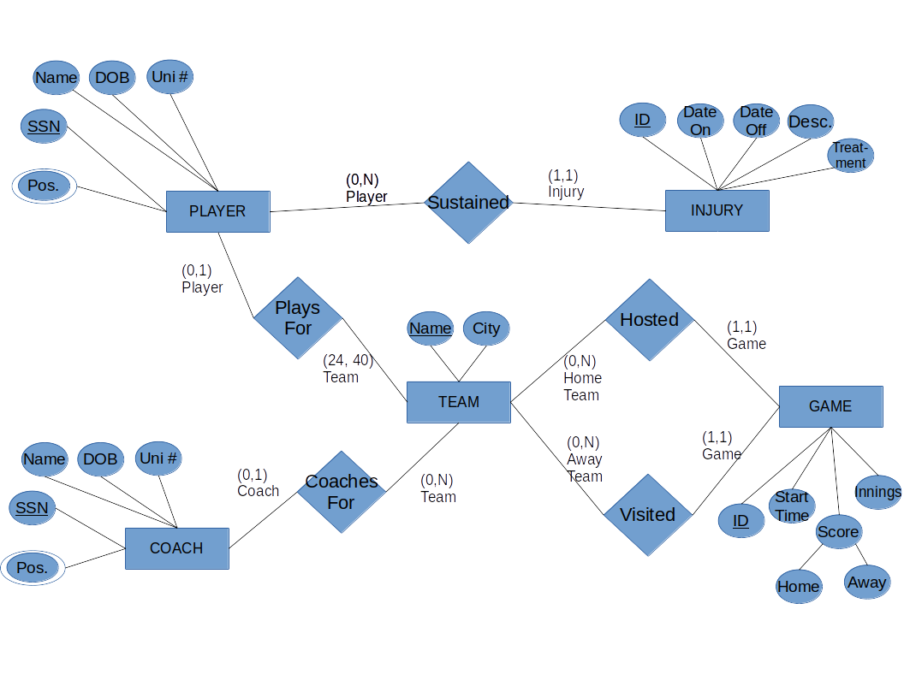

# Question 1
\

I made the following assumptions:

+ A department doesn't have to offer a course, but a course has to be offered by exactly one department
+ A course must have at least one section, and a section can only be associated with exactly one course
+ A section depends on a course to identify itself, so it is a weak entity type
+ A section does not have to give grades, but each grade must be associated with exactly one section
+ A grade depends on the Student Graded and Section Graded to identify itself, so it is a weak entity type
+ A student doesn't have to be graded, but each grade can only be associated with one student.
+ A student may only have one contact phone number on record at a time for local and one at a time for permanent.
+ A Major stems from a relationship between a Student and Department. A student must major from exactly one Department, but a Department doesn't have to offer a major to students.
+ A Minor stems from a relationship between a Student and Department. A student doesn't need to minor from a Department but can minor from as many as they wish, and a Department doesn't need to offer any minors but can offer as many as they wish. Multiple minors can exist in the relationship between a student and a department.

# Question 2
**Major League Baseball** consists of many teams. 

Each team has a Name, City, roster of players, and coaching staff. According to a [Wikipedia Article on MLB Rosters](https://en.wikipedia.org/wiki/Major_League_Baseball_rosters), teams are required to carry 24 players on their active roster, and are allowed to list up to 40 players (including those on the active roster) on the overall (or *Expanded*) roster. It is unclear if there is a minimum or maximum number of coaches allowed on the coaching staff.

Each player can belong only to one team, and has a name, date of birth, uniform number, SSN, set of positions played (a player can play Right Field, Center Field, and Left Field, for example), and a set of injuries. A player does not need to be actively signed with a team, in which case they are known as a *Free Agent*.

An injury record contains a unique ID, the dates the player was placed on and taken off the injury list, a description of the injury, and a description of any treatments made. Players may have as many injury records as needed, but exactly one injury report is required per player per injury. 

A coach has a name, position (Manager, Hitting, Pitching, etc.), date of birth, uniform number, and SSN. They may fulfil more than one position, and do not need to be actively signed with a team. The MLB is one of the few sports leagues where coaches wear the uniform of the team, complete with a uniform number.

Games occur between two teams (Home team and Away team), and contain a unique ID number, the timestamp (date and time) of the game's start, the Home team and Away team scores, and the number of innings played (to accommodate extra innings or suspended games).

Each team can be uniquely identified by their Name. Players and coaches are uniquely identified by their SSN. Injuries and Games have a unique integer identifier associated with them.

\

